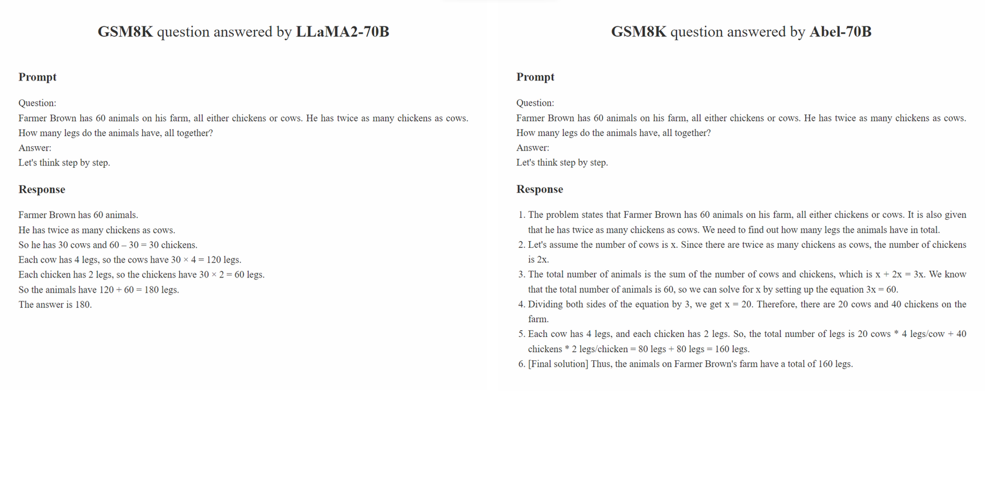

#  Generative AI for Math: *Abel*


[**Model**](https://github.com/GAIR-NLP/abel/#models-and-performance) | 
[**Leaderboard**](https://github.com/GAIR-NLP/abel/#Leaderboard-for-Mathematical-Reasoning) |
[**Methodology**](https://github.com/GAIR-NLP/abel/#methodology) | 
[**Evaluation**](https://github.com/GAIR-NLP/abel/#evaluation) |
[**Robustness Analysis**](https://github.com/GAIR-NLP/abel/#robustness-analysis) |
[**Limitation**](https://github.com/GAIR-NLP/abel/#limitation) |
[**Citation**](https://github.com/GAIR-NLP/abel/#Citation) |
[**Outlook**](https://github.com/GAIR-NLP/abel/#outlook) |

[Ethan Chern](https://ethanc111.github.io/)\*, [Haoyang Zou](https://plms.ai/people/index.html)\*, [Xuefeng Li](https://plms.ai/people/index.html)\*, [Jiewen Hu](https://www.linkedin.com/in/jiewen-hu/)\*, [Kehua Feng](https://plms.ai/people/index.html), [Junlong Li](https://scholar.google.com.hk/citations?user=UX7TpSYAAAAJ&hl=zh-CN), [Pengfei Liu](https://plms.ai/people/index.html)+
* "*" Core contributors, 
* "+" Corresponding Author, (GAIR) at Shanghai Jiao Tong University, Shanghai AI Lab

***


📝 `Abel` is created as a tribute to [Niels Henrik Abel](https://en.wikipedia.org/wiki/Niels_Henrik_Abel) for his groundbreaking work in algebra and analysis, at which our model is relatively better as well. There is still a long way for us to go, though 🏃‍♂️🏃‍♀️🏁🏃‍♂️🏃‍♀️.

We show that:
* **without** tools
* **without** continuing pretraining
* **without** reward model
* **without** RLHF
* **ONLY** using SFT

We have established a new **state-of-the-art** performance across open-source LLMs (that do not use external tools) on the GSM8k (**83.62**) and MATH (**28.26**) benchmarks. Specifically:
* the performance on GSM8K, at **83.62**, surpasses top-tier models, such as PaLM-1, Minerva (Google), Claude-instant (Anthropic), ChatGPT (OpenAI), with only a 1-percentage-point lag behind Google's latest model, PaLM-2-Flan.
* achieving an accuracy rate of 28.26% on **highly challenging mathematical competition problems** (compared to GPT4's 42.5%), it maintains a significant lead over other open-source models, surpassing the previous best open-source model by 5.46%.
* the 7B and 13B models have achieved a **historic milestone** in open-source model performance in both GSM8K and MATH.
* `GAIRMath-Abel` secures **3 positions in the Top 10 rankings** and stands as the **only university-led project** in the list (others are either star startups or big tech companies).
* Using our approach, we not only achieved excellent results on GSM8K and MATH, but when given a **new dataset** ([TALSCQ-EN](https://www.mathgpt.com/)), we **quickly** attained state-of-the-art (SOTA) performance without too much effort, surpassing the commercial multi-billion-dollar model [MathGPT](https://www.mathgpt.com/) and GPT4.
  
We demonstrate that:
* the capabilities of SFT are **significantly underestimated**, and researchers should approach SFT with due reverence and caution
* exceptional mathematical problem-solving capability can be achieved **solely through SFT**, which elicits more imaginative possibilities in future exploration in this direction.


## Models and Performance

| Model Name | HF Checkpoints | GSM8k | MATH | License |
| ----- |------| ---- |------|------|
| GAIRMath-Abel-70B | 🤗 <a href="https://huggingface.co/GAIR/GAIRMath-Abel-70b" target="_blank">70B</a> | **83.62** (+ 2.02) |  **28.26** (+ 5.56)| [Llama 2](https://ai.meta.com/resources/models-and-libraries/llama-downloads/) |
| GAIRMath-Abel-13B | 🤗 <a href="https://huggingface.co/GAIR/GAIRMath-Abel-13b" target="_blank">13B</a> | **66.41** (+ 2.51) |  **17.34** (+ 3.34)| [Llama 2](https://ai.meta.com/resources/models-and-libraries/llama-downloads/) |
| GAIRMath-Abel-7B | 🤗 <a href="https://huggingface.co/GAIR/GAIRMath-Abel-7b" target="_blank">7B</a> | **59.74** (+ 4.84) |  **13.00** (+ 2.30) | [Llama 2](https://ai.meta.com/resources/models-and-libraries/llama-downloads/) |

* numbers in ``()'' represent improvement against previous SOTA open-sourced methods, i.e., WizardMath.


## Leaderboard for Mathematical Reasoning

* `🔒` stands for the proprietary model while `🌍` represents the open-source model
* `🎓` suggests that model development is led by academic university (instead of companies)
* We only consider models **without** using any tool (e.g., Python)

| Ranking | Model        | Param. | Leading Organization              | GSM8K | MATH  |
| :-----: | :----------: | :----: | :-----------------------------------: | :---: | :---: |
|  🔒 1  | GPT-4        | unknown| [OpenAI](https://openai.com/)                                | 92.0    | 42.5  |
|  🔒 2  | Claude-2     | unknown| [Anthropic](https://www.anthropic.com/)                             | 88.0    | -     |
|  🔒 3  | PaLM-2-Flan  | unknown| [Google](https://about.google/)                               | 84.7  | 33.2  |
|  🌍 4      | GAIRMath-*Abel*         | 70B    | 🎓 [GAIR Lab at Shanghai Jiaotong University](https://plms.ai/)| 83.6  | 28.3  |
|  🌍 5      | WizardMath   | 70B    | [Microsoft](https://www.microsoft.com/)                            | 81.6  | 22.7  |
|  🔒 6     | Claude-Instant| unknown| [Anthropic](https://www.anthropic.com/)                           | 80.9  | -     |
|  🔒 7     | ChatGPT      | unknown| [OpenAI](https://openai.com/)                                | 80.8  | 34.1  |
|  🔒 8      | ChatGPT-0301 | unknown| [OpenAI](https://openai.com/)                               | 74.9  | -     |
|  🌍 9     | GAIRMath-*Abel*         | 13B    | 🎓 [GAIR Lab at Shanghai Jiaotong University](https://plms.ai/)| 66.4  | 17.3  |
|  🌍 10     | GAIRMath-*Abel*         | 7B     | 🎓 [GAIR Lab at Shanghai Jiaotong University](https://plms.ai/)| 59.7 | 13.0  |
|  🔒 11    | Minerva      | 540B   | [Google](https://about.google/)                               | 58.8  | 33.6  |
|  🔒 12    | PaLM         | 540B   | [Google](https://about.google/)                               | 56.9  | 8.8   |
| 🌍 13    | Llama-2      | 70B    | [Meta](https://about.meta.com/)                                 | 56.8  | 13.5  |
| 🌍 14    | RFT          | 33B    | [OFA](https://github.com/OFA-Sys)                                  | 56.5  | 7.4   |
| 🌍 15    | Baichuan2-13B| 13B    | [Baichuan](https://www.baichuan-ai.com/home)                             | 52.8  | 10.1 |
| 🔒 16    | Minerva      | 62B    | [Google](https://about.google/)                               | 52.4  | 27.6  |
| 🔒 17    | PaLM         | 64B    | [Google](https://about.google/)                               | 52.4  | 4.4   |
| 🌍 18    | RFT          | 13B    | [OFA](https://github.com/OFA-Sys)                                  | 52.1  | 5.1   |
| 🌍 19    | LlaMA        | 65B    | [Meta](https://about.meta.com/)                                 | 50.9  | 10.6  |
| 🌍 20    | QWen         | 7B     | [Alibaba](https://www.alibaba.com/)                              | 44.9  | 8.5   |
| 🔒 21    | Chinchilla   | 70B    | [DeepMind](https://www.deepmind.com/)                             | 43.7  | -     |
| 🌍 22    | Llama-2      | 34B    | [Meta](https://about.meta.com/)                                 | 42.2  | 6.24  |
| 🔒 23    | Galactica    | 30B    | [Meta](https://about.meta.com/)                                 | 41.7  | 12.7  |
| 🌍 24    | ChatGLM2     | 12B    | [Zhipu](https://www.zhipuai.cn/)                                | 40.9  | -     |
| 🔒 25    | Text-davinci-002| 175B| [OpenAI](https://openai.com/)                              | 40.7  | 19.1  |
| 🌍 26    | Llama        | 33B    | [Meta](https://about.meta.com/)                                 | 35.6  | 7.1   |
| 🔒 27    | GPT-3        | 175B   | [OpenAI](https://openai.com/)                               | 34    | 5.2   |
| 🌍 28    | InternLM     | 7B     | [Shanghai AI Lab](https://www.shlab.org.cn/)                      | 31.2  | -     |
| 🌍 29    | Llama-2      | 13B    | [Meta](https://about.meta.com/)                                 | 28.7  | 3.9   |
| 🌍 30    | Vicuna v1.3  | 13B    | [LMSys](https://lmsys.org/)                                | 27.6  | -     |
| 🌍 31    | Falcon       | 40B    | [Technology Innovation Institute](https://www.tii.ae/)                               | 19.6  | 2.5   |
| 🌍 32    | Llama        | 13B    | [Meta](https://about.meta.com/)                                 | 17.8  | 3.9   |
| 🌍 33    | MPT          | 30B    | [MosaicML](https://www.mosaicml.com/)                                  | 15.2  | 3.1   |
| 🔒 34    | Galactica    | 6.7B   | [Meta](https://about.meta.com/)                                 | 10.2  | 2.2   |


## Methodology

We propose ***Parental Oversight***,  A ***Babysitting Strategy*** for Supervised Fine-tuning,

`Parental Oversight` is not limited to any specific data processing method. Instead, it defines the data processing philosophy that should guide supervised fine-tuning in the era of Generative AI (GAI). We believe that in the era of GAI, [**data structure engineering**](https://arxiv.org/pdf/2206.11147.pdf) has emerged as a new paradigm. Within this paradigm, the manner in which the fine-tuning data is processed significantly impacts the performance of the trained GAI. We expect a growing number of studies in the community to focus on this data processing philosophy.

The principle of `Parental Oversight` emphasizes treating supervised fine-tuning with care and prudence. This is analogous to the way parents are encouraged to educate their children. Different types of data, along with their presentation formats (e.g., step-by-step reasoning, iterative refinement), can be likened to varied educational methods. Just as parents cautiously select the most effective approach to instruct their children, GAI practitioners should cautiously select the most effective data processing approaches to better instruct their LLMs.

Furthermore, the "the more data, the better" philosophy doesn't always hold true. The quality and relevance of annotated samples can often outweigh their quantity. Training samples used in SFT should not just present the right answer, but also instruct the model on how the correct answer was derived based on the knowledge of the LLM. Additionally, if the LLM's knowledge is not sufficient to answer a question, `Parental Oversight` should step in to address the knowledge gaps promptly.

## Evaluation
* Create a conda environment `conda create -n abel python=3.10`
* Activate the environment `conda activate abel`
* Run `pip install -r requirements.txt`.
* Run `bash evaluation/eval.sh`. Part of the evaluation script is modified from [Minerva](https://arxiv.org/pdf/2206.14858.pdf).
* Note: We did observe some non-fully deterministic nature when conducting evaluation, which might be related to [this vllm issue](https://github.com/vllm-project/vllm/issues/966). Thus, it's possible that the result you obtain may slightly differ from ours. You can also check our evaluation output in the `./outputs` directory.


## Robustness Analysis
Our robustness analysis consists of two parts: **Adversarial Evaluation on the [GSM8k_robust dataset](https://github.com/GAIR-NLP/abel/blob/main/data/test/test.jsonl)** and **Supervised Transfer Learning on the [TAL-SCQ5K-EN dataset](https://www.mathgpt.com/)**. We perform a preliminary analysis to understand (1) whether Abel overfits the training dataset and is thus brittle to out-of-distribution testing samples and (2) whether our SFT approach can quickly transfer and generalize Abel to datasets from different distributions.


### Adversarial Evaluation on the GSM8k_robust Dataset
The GSM8k_robust dataset is a dataset we established based on the GSM8k dataset. We randomly modified the numbers within the questions of the GSM8k dataset, without altering any other information in the questions, using GPT-4. We also asked GPT-4 to generate the 'golden answers' for the modified questions. After manually reviewing a subset of these samples, we found that all the generated answers for the altered questions were accurate. We utilized the GSM8k_robust dataset to evaluate whether the models overfit the training data, making the models susceptible to out-of-distribution testing samples. Our analysis indicates that Abel is more robust to out-of-distribution testing samples compared to other models.


| Model |  GSM8k | GSM8k_robust  | delta |
| :-----: | :---: | :---: | :---: |
|  Abel-7B  | 59.74 | 58.23 | -1.51 |
|  Abel-13B  | 66.41 |  66.57 | +0.16 |
|  Abel-70B  | 83.62 |  81.80 | -1.82 |
|  WizardMath-70B  | 81.60 |  74.91  | -6.70 |
|  WizardMath-13B  | 63.90 |  59.51 | -4.39 |
|  RFT-7B  | 41.7 | 37.98 | -3.72 |

### Supervised Transfer Learning on the TAL-SCQ5K-EN Dataset
We demonstrate that Abel-70B not only achieves SOTA on the GSM8k and MATH datasets but also generalizes well to TAL-SCQ5K-EN 2K, a newly released dataset by Math LLM provider TAL (好未來). Our analysis indicates that our SFT approach can successfully generalize Abel to datasets from different distributions. We will conduct further analyses and experiments to explore and improve Abel's generalization capabilities.

| Model | TAL-SCQ5K-EN 2K Testing Benchmark|
| :-----: | :---: |
|  Abel-70B  | 59.7 |
|  MathGPT  | 59.0 |
|  GPT-4  | 51.0  |
|  Llama-70B  | 43.8 |

## Demo



## Limitation
* **Overfitting**: Despite conducting robustness analysis and considering that generative AI for mathematics inherently exhibits fragility (often necessitating advanced decoding strategies, such as majority voting), excessive reliance on constructing SFT samples to enhance performance can inevitably lead the model towards overfitting. (However, overfitting is not the primary concern of the current project because even with overfitting various augmented training data, it remains challenging to achieve favorable results on the test set, such as the MATH dataset, for complex mathematical reasoning tasks.) Nevertheless, we still need to perform more extensive robust analysis (https://github.com/GAIR-NLP/abel/issues/1) and actively explore training methods that can transform the model into a mathematical polymath and conduct a more comprehensive cross-domain generalization analysis.
* **Generalization**: A good mathematical model should not be limited to solving problems only on GSM8K and MATH datasets; it should be capable of handling various types of problems, including those that assess different knowledge domains and require different types of responses (e.g., multiple-choice, true/false, proofs, arithmetic, etc.). The current model's capabilities are insufficient to generalize to these diverse scenarios (https://github.com/GAIR-NLP/abel/issues/2).
* **Universality**: Ultimately, we anticipate that the mathematical reasoning abilities enabled by large models can be integrated into chatbots for various domains such as medicine, law, physics, chemistry, etc. The key to achieving AGI is incorporating the power of a strong mathematical model into other models, which is currently lacking in the current model (https://github.com/GAIR-NLP/abel/issues/3).
* **Multilinguality**: The current model's training data and base model constraints limit its ability to provide responses in languages other than English (https://github.com/GAIR-NLP/abel/issues/4).
* **Advanced techniques**: The current model primarily focuses on SFT, and advanced techniques such as reward models, RLHF (Reinforcement Learning from Human Feedback), and tools have not yet been explored. (https://github.com/GAIR-NLP/abel/issues/5, https://github.com/GAIR-NLP/abel/issues/6)

We have created a [list of issues](https://github.com/GAIR-NLP/abel/issues) to maintain these limitations and potential solutions. Your opinions and comments are always welcome.


## Citation
Please cite the repo if the model/code/conclusion in this repo are helpful to you.

```
@misc{abel,
  author = {Chern, Ethan and Zou, Haoyang and Li, Xuefeng and Hu, Jiewen and Feng, Kehua and Li, Junlong and Liu, Pengfei},
  title = {Generative AI for Math: Abel},
  year = {2023},
  publisher = {GitHub},
  journal = {GitHub repository},
  howpublished = {\url{https://github.com/GAIR-NLP/abel}},
}
```

## Acknowledgement
* We thank the Shanghai AI Lab for supporting a portion of the computing resources.
* We thank Jiasheng Gu for the helpful discussions in the early stage of the project.

## Outlook
We are continuously refining our models and will be releasing updates. Stay tuned!

